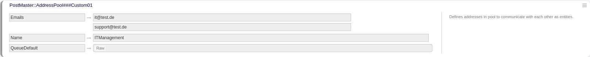

.. toctree::
    :maxdepth: 2
    :caption: Contents

Sacrifice to Sphinx
===================

Description
===========
Treat addresses as separate entities, allowing to send emails from one to another, and treat incoming emails independently for each.

System requirements
===================

Framework
---------
OTOBO 10.1.x

Packages
--------
\-

Third-party software
--------------------
\-

Usage
=====

Setup
-----
Go to "Admin -> System Configuration" and search for "AddressPool".

You have to choose one of them for example and define a pool name with their mail addresses and default queue.

|

|

Configuration Reference
-----------------------

Core::Email::PostMaster::AddressPool
^^^^^^^^^^^^^^^^^^^^^^^^^^^^^^^^^^^^^^^^^^^^^^^^^^^^^^^^^^^^^^^^^^^^^^^^^^^^^^^^^^^^^^^^^^^^^^^^^^^^^^^^^^^^^^^^^^^^^^^^^^^^^^

PostMaster::AddressPool###Custom01
""""""""""""""""""""""""""""""""""""""""""""""""""""""""""""""""""""""""""""""""""""""""""""""""""""""""""""""""""""""""""""""
Defines addresses in pool to communicate with each other as entities.

PostMaster::AddressPool###Custom02
""""""""""""""""""""""""""""""""""""""""""""""""""""""""""""""""""""""""""""""""""""""""""""""""""""""""""""""""""""""""""""""
Defines addresses in pool to communicate with each other as entities.

PostMaster::AddressPool###Custom03
""""""""""""""""""""""""""""""""""""""""""""""""""""""""""""""""""""""""""""""""""""""""""""""""""""""""""""""""""""""""""""""
Defines addresses in pool to communicate with each other as entities.

PostMaster::AddressPool###Custom04
""""""""""""""""""""""""""""""""""""""""""""""""""""""""""""""""""""""""""""""""""""""""""""""""""""""""""""""""""""""""""""""
Defines addresses in pool to communicate with each other as entities.

PostMaster::AddressPool###Custom05
""""""""""""""""""""""""""""""""""""""""""""""""""""""""""""""""""""""""""""""""""""""""""""""""""""""""""""""""""""""""""""""
Defines addresses in pool to communicate with each other as entities.

PostMaster::AddressPool###Custom06
""""""""""""""""""""""""""""""""""""""""""""""""""""""""""""""""""""""""""""""""""""""""""""""""""""""""""""""""""""""""""""""
Defines addresses in pool to communicate with each other as entities.

PostMaster::AddressPool###Custom07
""""""""""""""""""""""""""""""""""""""""""""""""""""""""""""""""""""""""""""""""""""""""""""""""""""""""""""""""""""""""""""""
Defines addresses in pool to communicate with each other as entities.

PostMaster::AddressPool###Custom08
""""""""""""""""""""""""""""""""""""""""""""""""""""""""""""""""""""""""""""""""""""""""""""""""""""""""""""""""""""""""""""""
Defines addresses in pool to communicate with each other as entities.

PostMaster::AddressPool###Custom09
""""""""""""""""""""""""""""""""""""""""""""""""""""""""""""""""""""""""""""""""""""""""""""""""""""""""""""""""""""""""""""""
Defines addresses in pool to communicate with each other as entities.

PostMaster::AddressPool###Custom10
""""""""""""""""""""""""""""""""""""""""""""""""""""""""""""""""""""""""""""""""""""""""""""""""""""""""""""""""""""""""""""""
Defines addresses in pool to communicate with each other as entities.

PostMaster::PreFilterModule###000-MatchMessageID
""""""""""""""""""""""""""""""""""""""""""""""""""""""""""""""""""""""""""""""""""""""""""""""""""""""""""""""""""""""""""""""
Module to check if mail with message id already exist.

Core::LinkObject
^^^^^^^^^^^^^^^^^^^^^^^^^^^^^^^^^^^^^^^^^^^^^^^^^^^^^^^^^^^^^^^^^^^^^^^^^^^^^^^^^^^^^^^^^^^^^^^^^^^^^^^^^^^^^^^^^^^^^^^^^^^^^^

LinkObject::PossibleLink###2200
""""""""""""""""""""""""""""""""""""""""""""""""""""""""""""""""""""""""""""""""""""""""""""""""""""""""""""""""""""""""""""""
Links 2 tickets with a "Interdivisional" type link.

LinkObject::Type###Interdivisional
""""""""""""""""""""""""""""""""""""""""""""""""""""""""""""""""""""""""""""""""""""""""""""""""""""""""""""""""""""""""""""""
This setting defines the link type 'Interdivisional'. If the source name and the target name contain the same value, the resulting link is a non-directional one. If the values are different, the resulting link is a directional link.

About
=======

Contact
-------
| Rother OSS GmbH
| Email: hello@otobo.de
| Web: https://otobo.de

Version
-------
Author: |doc-vendor| / Version: |doc-version| / Date of release: |doc-datestamp|
